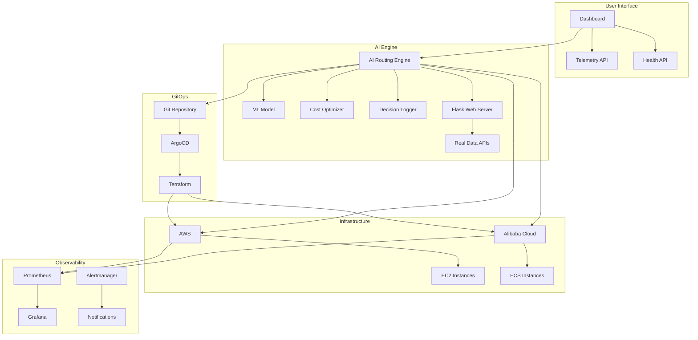
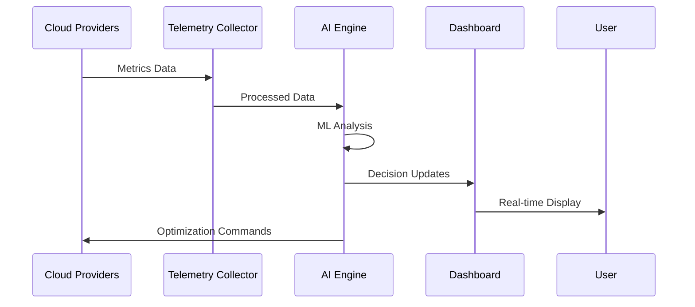
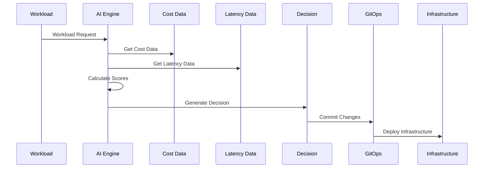

# SWEN GitOps + AIOps Architecture

## System Overview

The SWEN GitOps + AIOps platform is a comprehensive, self-healing, cost-optimizing cloud infrastructure system that autonomously manages AI workloads across multiple cloud providers. The architecture demonstrates how modern infrastructure can be intelligent, self-aware, and continuously optimizing.

## High-Level Architecture



## Component Architecture

### 1. AI Routing Engine

The AI Routing Engine is the brain of the system, making intelligent decisions about workload placement based on cost, latency, and performance metrics.

#### Flask Web Server Integration
The AI Engine now includes a Flask web server that exposes real-time data via REST APIs:

```python
class AIRoutingEngine:
    def __init__(self):
        # Initialize Flask web server with CORS
        self.app = Flask(__name__)
        CORS(self.app)  # Enable CORS for all routes
        self._setup_routes()
    
    def _setup_routes(self):
        """Setup Flask API routes"""
        
        @self.app.route('/health', methods=['GET'])
        def health():
            return jsonify({
                'status': 'healthy',
                'timestamp': datetime.now().isoformat(),
                'ai_engine': 'running'
            })
        
        @self.app.route('/telemetry', methods=['GET'])
        def telemetry():
            # Return real AWS data + simulated Alibaba data
            return jsonify(self.get_latest_telemetry())
        
        @self.app.route('/workloads', methods=['GET'])
        def get_workloads():
            return jsonify({
                'workloads': self.workload_queue,
                'pending': self.pending_workloads,
                'completed': len(self.decision_history)
            })
        
        @self.app.route('/workload', methods=['POST'])
        def submit_workload():
            # Accept workload requests via API
            data = request.get_json()
            workload = Workload(**data)
            self.workload_queue.append(workload)
            return jsonify({'message': 'Workload submitted successfully'})
```

**API Endpoints:**
- `GET /health` - Health check endpoint
- `GET /telemetry` - Real-time telemetry data
- `GET /workloads` - Workload queue status
- `POST /workload` - Submit new workload
- `GET /pending` - Pending approval requests

#### Machine Learning Pipeline
```python
class AIRoutingEngine:
    def __init__(self):
        self.ml_model = RandomForestRegressor()
        self.scaler = StandardScaler()
        self.decision_history = []
    
    def calculate_optimal_placement(self, workload):
        # Analyze current provider states
        providers = self._get_current_provider_states()
        
        # Calculate scores for each provider
        scores = {}
        for provider_name, provider_data in providers.items():
            score = self._calculate_provider_score(workload, provider_data)
            scores[provider_name] = score
        
        # Select best provider
        best_provider = max(scores.items(), key=lambda x: x[1])
        return best_provider
```

### 2. Infrastructure as Code (IaC)

The infrastructure is defined using Terraform modules for both AWS and Alibaba Cloud, ensuring consistency and reproducibility.

#### Terraform Structure
```
infra/terraform/
├── main.tf                 # Main configuration
├── variables.tf           # Input variables
├── outputs.tf            # Output values
└── modules/
    ├── aws/               # AWS infrastructure
    │   ├── main.tf
    │   ├── variables.tf
    │   └── outputs.tf
    └── alibaba/           # Alibaba Cloud infrastructure
        ├── main.tf
        ├── variables.tf
        └── outputs.tf
```

#### Multi-Cloud Configuration
```hcl
# AWS Provider
provider "aws" {
  region = var.aws_region
  default_tags {
    tags = {
      Project     = "SWEN-GitOps-AIOps"
      Environment = var.environment
      ManagedBy   = "Terraform"
    }
  }
}

# Alibaba Cloud Provider
provider "alicloud" {
  region = var.alibaba_region
}
```

### 3. GitOps Pipeline

The GitOps pipeline automates infrastructure deployment and management through Git-based workflows.

#### Pipeline Stages
1. **Validation**: Terraform validation and security scanning
2. **AI Optimization**: AI-driven cost and performance optimization
3. **Planning**: Terraform plan generation
4. **Approval**: Manual approval for high-impact changes
5. **Deployment**: Automated infrastructure deployment
6. **Monitoring**: Post-deployment monitoring and validation

#### GitOps Workflow
```yaml
stages:
  - validate
  - plan
  - security-scan
  - ai-optimization
  - apply
  - monitor
```

### 4. Live Telemetry Dashboard

The dashboard provides real-time visibility into system performance, costs, and AI decisions.

#### Dashboard Components
- **Real-time Metrics**: Live telemetry data visualization
- **Cost Analysis**: Cost trends and optimization opportunities
- **AI Decisions**: Live AI routing decisions and explanations
- **Performance Monitoring**: System performance metrics
- **Alert Management**: Alert visualization and management

#### Technology Stack
- **Frontend**: React/Next.js with TypeScript
- **Charts**: Recharts for data visualization
- **Real-time**: WebSocket for live updates
- **Styling**: Tailwind CSS for responsive design

### 5. Observability Stack

Comprehensive monitoring and observability using Prometheus, Grafana, and related tools.

#### Monitoring Components
- **Prometheus**: Metrics collection and storage
- **Grafana**: Visualization and dashboards
- **Alertmanager**: Alert management
- **Jaeger**: Distributed tracing
- **ELK Stack**: Log aggregation and analysis

#### Observability Architecture
```yaml
services:
  prometheus:
    image: prom/prometheus:latest
    ports: ["9090:9090"]
    volumes:
      - ./prometheus.yml:/etc/prometheus/prometheus.yml
  
  grafana:
    image: grafana/grafana:latest
    ports: ["3000:3000"]
    environment:
      - GF_SECURITY_ADMIN_PASSWORD=swen-admin-2024
```

## Data Flow Architecture

### 1. Telemetry Data Flow



### 2. AI Decision Flow



## Security Architecture

### 1. Network Security
- **VPC Isolation**: All resources in private VPCs
- **Security Groups**: Restrictive security group rules
- **WAF Protection**: Web Application Firewall
- **DDoS Protection**: DDoS protection enabled

### 2. Access Control
- **IAM Policies**: Principle of least privilege
- **Multi-Factor Authentication**: MFA required
- **Role-Based Access**: Role-based access control
- **API Security**: API key management and rotation

### 3. Data Protection
- **Encryption**: Data encryption at rest and in transit
- **Key Management**: Centralized key management
- **Backup Security**: Encrypted backups
- **Audit Logging**: Comprehensive audit logs

## Scalability Architecture

### 1. Horizontal Scaling
- **Auto-scaling Groups**: Automatic scaling based on demand
- **Load Balancing**: Distributed load across instances
- **Multi-Region**: Multi-region deployment
- **Multi-Cloud**: Multi-cloud redundancy

### 2. Vertical Scaling
- **Instance Types**: Dynamic instance type selection
- **Resource Optimization**: AI-driven resource optimization
- **Performance Tuning**: Continuous performance optimization
- **Capacity Planning**: Predictive capacity planning

### 3. Data Scaling
- **Data Partitioning**: Horizontal data partitioning
- **Caching**: Multi-level caching strategy
- **CDN**: Content delivery network
- **Database Sharding**: Database sharding for large datasets

## Cost Optimization Architecture

### 1. AI-Driven Cost Optimization
- **Real-time Analysis**: Continuous cost analysis
- **Predictive Modeling**: Cost prediction models
- **Automated Decisions**: Automated cost optimization
- **Human Oversight**: Human oversight and approval

### 2. Multi-Cloud Cost Arbitrage
- **Cost Comparison**: Real-time cost comparison
- **Regional Optimization**: Regional cost optimization
- **Instance Optimization**: Instance type optimization
- **Spot Instance Strategy**: Aggressive spot instance usage

### 3. Resource Efficiency
- **Right-Sizing**: AI-driven right-sizing
- **Auto-Scaling**: Intelligent auto-scaling
- **Resource Utilization**: Resource utilization optimization
- **Waste Elimination**: Waste elimination strategies

## High Availability Architecture

### 1. Fault Tolerance
- **Multi-AZ Deployment**: Multi-availability zone deployment
- **Load Balancing**: Load balancing for all services
- **Auto-Scaling**: Automatic scaling based on demand
- **Health Checks**: Comprehensive health checks

### 2. Disaster Recovery
- **Backup Strategy**: Comprehensive backup strategy
- **Recovery Procedures**: Disaster recovery procedures
- **RTO/RPO**: Defined recovery time and point objectives
- **Testing**: Regular disaster recovery testing

### 3. Business Continuity
- **Redundancy**: Multi-level redundancy
- **Failover**: Automatic failover mechanisms
- **Monitoring**: Continuous monitoring and alerting
- **Incident Response**: Automated incident response

## Performance Architecture

### 1. Performance Optimization
- **Caching**: Multi-level caching strategy
- **CDN**: Content delivery network
- **Database Optimization**: Database performance optimization
- **Network Optimization**: Network performance optimization

### 2. Monitoring and Alerting
- **Real-time Monitoring**: Real-time performance monitoring
- **Alerting**: Proactive alerting on performance issues
- **Dashboards**: Performance dashboards
- **Reporting**: Performance reporting and analysis

### 3. Capacity Planning
- **Demand Forecasting**: Predictive demand forecasting
- **Resource Planning**: Resource capacity planning
- **Scaling Strategies**: Scaling strategy optimization
- **Cost-Performance Balance**: Cost-performance optimization

## Integration Architecture

### 1. API Integration
- **REST APIs**: RESTful API design
- **GraphQL**: GraphQL for complex queries
- **WebSocket**: Real-time communication
- **Message Queues**: Asynchronous message processing

### 2. Data Integration
- **ETL Pipelines**: Extract, transform, load pipelines
- **Data Lakes**: Data lake architecture
- **Data Warehouses**: Data warehouse integration
- **Real-time Streaming**: Real-time data streaming

### 3. Third-party Integration
- **Cloud Providers**: Multi-cloud integration
- **Monitoring Tools**: Monitoring tool integration
- **Security Tools**: Security tool integration
- **Development Tools**: Development tool integration

## Deployment Architecture

### 1. Infrastructure Deployment
- **Terraform**: Infrastructure as code
- **GitOps**: Git-based deployment
- **CI/CD**: Continuous integration and deployment
- **Blue-Green**: Blue-green deployment strategy

### 2. Application Deployment
- **Containerization**: Docker containerization
- **Orchestration**: Kubernetes orchestration
- **Service Mesh**: Service mesh architecture
- **Microservices**: Microservices architecture

### 3. Configuration Management
- **Configuration as Code**: Configuration as code
- **Secrets Management**: Secrets management
- **Environment Management**: Environment management
- **Version Control**: Configuration version control

## Monitoring and Observability

### 1. Metrics Collection
- **Prometheus**: Metrics collection and storage
- **Custom Metrics**: Custom application metrics
- **Infrastructure Metrics**: Infrastructure metrics
- **Business Metrics**: Business metrics

### 2. Logging
- **Centralized Logging**: Centralized log collection
- **Structured Logging**: Structured log format
- **Log Analysis**: Log analysis and search
- **Log Retention**: Log retention policies

### 3. Tracing
- **Distributed Tracing**: Distributed request tracing
- **Performance Analysis**: Performance analysis
- **Dependency Mapping**: Service dependency mapping
- **Error Tracking**: Error tracking and analysis

## Future Architecture Considerations

### 1. Emerging Technologies
- **Edge Computing**: Edge computing integration
- **5G Networks**: 5G network optimization
- **Quantum Computing**: Quantum computing preparation
- **AI/ML Advances**: Advanced AI/ML integration

### 2. Scalability Improvements
- **Microservices**: Microservices architecture
- **Serverless**: Serverless computing
- **Event-Driven**: Event-driven architecture
- **Reactive Systems**: Reactive system design

### 3. Security Enhancements
- **Zero Trust**: Zero trust security model
- **Blockchain**: Blockchain integration
- **Advanced Encryption**: Advanced encryption techniques
- **AI Security**: AI-powered security

---

*This architecture document provides a comprehensive overview of the SWEN GitOps + AIOps platform architecture, demonstrating how modern infrastructure can be intelligent, self-aware, and continuously optimizing.*
